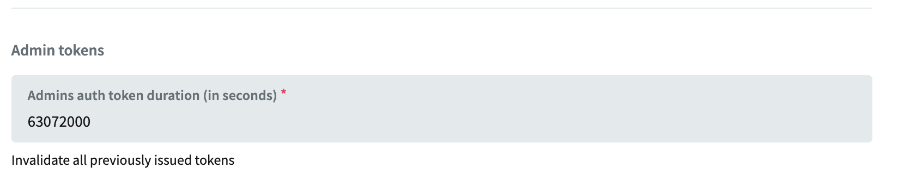

# suaobra-app


# Stack

## Backend

- PocketBase for API & Auth layer
- SQLite for OLTP
- Duck for OLAP and Rudderstack
- Rudderstack to webhook, which appends into DuckDB
- Budibase for Tooling, querying PocketBase

## Frontend

- Astro
  - UI Islands with React/Preact
  - Nanostore
- Cloudflare Pages
  - using Wrangler
- Budibase for Tooling, querying PocketBase

# Getting a new Admin Token

**Set Duration to 2 years (63072000 sec)**


Then run:

```bash
curl -d '{"identity":"flarco@live.com", "password":"xxxxxxxxxxx"}' -H "Content-Type: application/json" -X POST http://127.0.0.1:8090/api/admins/auth-with-password
```

# Export/Importing Data

```bash
$ sqlite3 data/main/data.db ".dump 'users_legacy'" > dump.sql
$ croc send dump.sql
....
# on other machine
$ cat dump.sql | sqlite3 data/data.db
```
